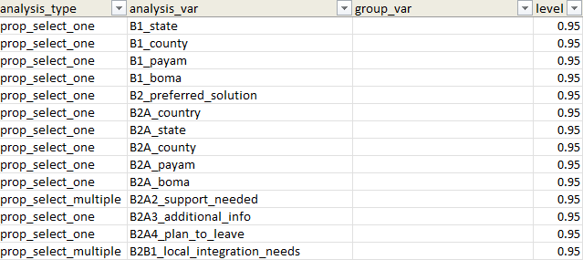
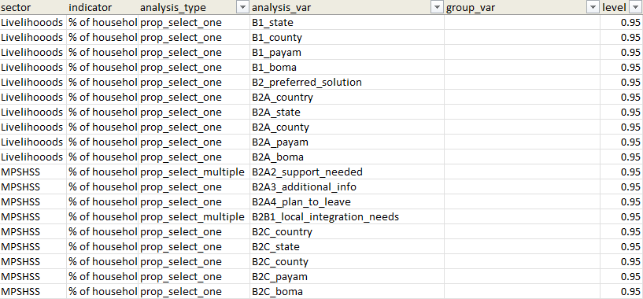

# Data Analysis

The `extrar` package takes the headache out of complex survey data
analysis by automatically processing multiple grouping variables at once
and seamlessly mapping metadata (like sectors and indicators) straight
from your List of Analysis (LOA) into the final output.

## Step 1: Prepare the List of Analysis (LOA)

Create or load your LOA file. It must contain these columns:

| Column          | Description                                           |
|-----------------|-------------------------------------------------------|
| `analysis_type` | Type of analysis (e.g. `prop_select_one`, `mean`)     |
| `analysis_var`  | The variable to analyse                               |
| `group_var`     | Leave blank — populated automatically by the pipeline |
| `level`         | Confidence level, e.g. `0.95`                         |

**Note on Metadata:** You can include optional metadata columns such as
`sector`, `indicator`, and `sub_indicator` directly in your LOA file.
These extra columns will be automatically joined to the results when you
pass their names via the `extra_columns` argument in Step 2. Look at the
examples below for more information.

``` r

library(readxl)
loa <- read_excel("path/to/loa.xlsx")

# Define the grouping variables (Overall must come first)
grouping_variables <- c("Overall", "gender", "female_hoh")
```

## Step 2: Run the Analysis Pipeline

[`run_group_analysis_pipeline()`](https://iathman83.github.io/ExtraR/reference/run_group_analysis_pipeline.md)
loops over every grouping variable and produces a single combined wide
dataset.

``` r

library(extrar)

group_analysis <- run_group_analysis_pipeline(
  dataset          = my_dataset,
  loa              = loa,
  group_variables  = grouping_variables,
  tool_survey      = tool_survey,
  tool_choices     = tool_choices,
  weight_column    = "weights",
  strata_column    = "sample_location",
  extra_columns    = c("sector", "indicator", "sub_indicator")  # optional
)

# Access the combined results
group_analysis$combined_results
```

## Step 3: Export a Formatted Excel Output

[`format_my_xlsx_variable_x_group()`](https://iathman83.github.io/ExtraR/reference/format_my_xlsx_variable_x_group.md)
takes the combined results and writes a styled Excel file.

- If `insert_empty_rows = TRUE`, a blank separator row is inserted after
  every block of related questions.
- `empty_rows_col` controls which column defines the grouping for blank
  row insertion. It defaults to `"analysis_var"` (renamed to
  `"question"` in the output), since all rows for a given question share
  the same value.

``` r

format_my_xlsx_variable_x_group(
  table_group_x_variable = group_analysis$combined_results,
  file_path              = "output/analysis_output.xlsx",
  insert_empty_rows      = TRUE,
  empty_rows_col         = "analysis_var",  # groups rows by question block
  overwrite              = TRUE
)
```

## Examples

Below are examples of how the LOA translates into the final formatted
Excel output.

### 1. Basic Analysis (Without Extra Columns)

When running the pipeline with standard analysis types and no extra
metadata columns:

    


*Left: Basic LOA input. Right: Resulting formatted Excel output.*

### 2. Advanced Analysis (With Extra Columns)

When passing metadata columns (like `sector` and `indicator`) via the
`extra_columns` argument, they are neatly preserved and arranged in the
final output block:

    


*Left: LOA with sector/indicator columns. Right: Output featuring those
extra columns mapped correctly.*
